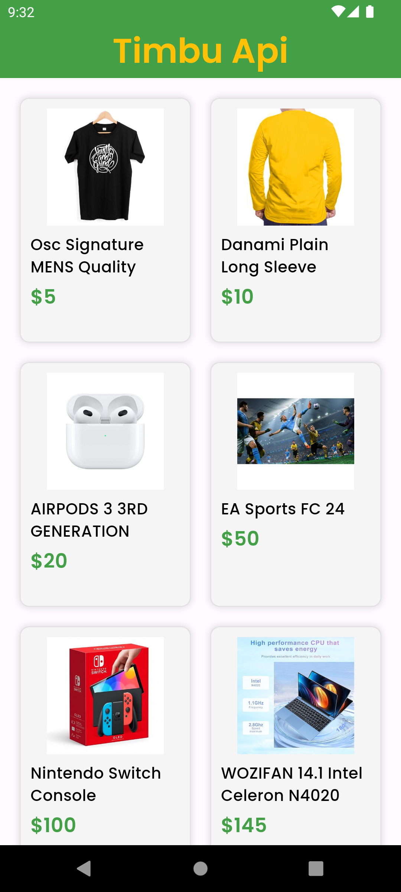
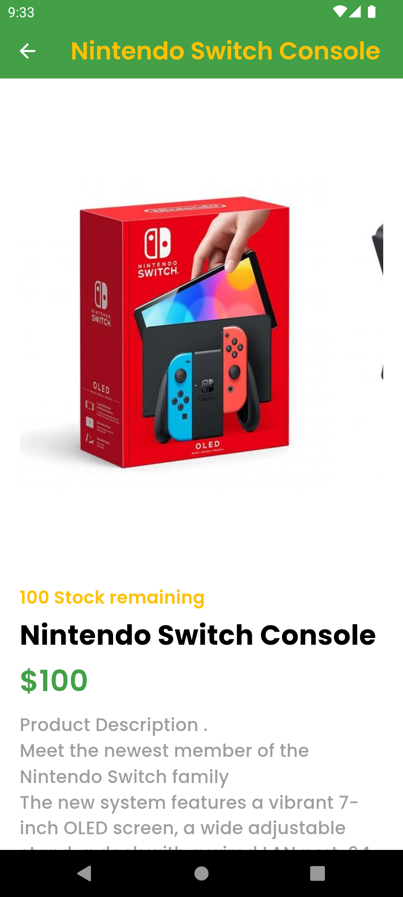

# Timbu API Integration App

This Flutter application is designed to integrate with the Timbu API to retrieve and display product information. The app adheres to the MVVM architecture pattern and showcases a list of products with their images and relevant details.

## Features

- Fetches product data from the Timbu API.
- Displays a list of products with images, names, descriptions, and available quantities.
- Implements proper mobile architecture with state management.
- Ensures a user-friendly and intuitive UI.

## Screenshots

### Splash Screen

### Products Screen

### Product Details Screen

## Setup Instructions

### Prerequisites

- Flutter SDK: [Installation Guide](https://flutter.dev/docs/get-started/install)
- Timbu API account: [Sign up here](https://timbu.cloud)

### Project Setup

1. **Clone the repository**

   git clone <https://github.com/fidelity2851/timbu_api_implementation_hng.git>

   cd timbu_api_implementation_hng

   flutter pub get

   flutter run

### Demo

A virtualized demonstration of the app is available on [Appetize.io](https://appetize.io/app/b_ifa3boeyf2mqwapnxnuwobpxjm)

### License

Distributed under the MIT License.
